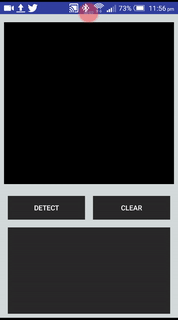

# Android App for Arabic Handwritten Digits Recognition

This repo contains a demo android application using TensorFlow for Android devices.This application used to classify and recognize Arabic
handwritten digits based on trained CNN python model using tensorflow as a framework and Keras on the top of it. In the traning I used MADBase
(Modified ArabicHandwritten Digits Databases) dataset. The dataset is available for free and can be downloaded from [here](http://datacenter.aucegypt.edu/shazeem/) .

The app was tested on android 5 device with API 21.
More information about using tensorflow can be found [here](https://www.tensorflow.org/versions/master/tutorials/).
